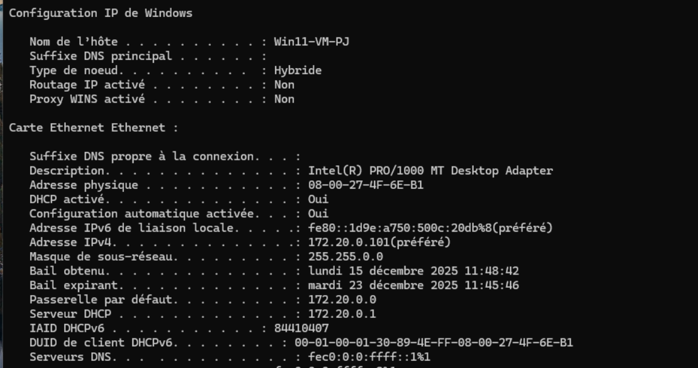
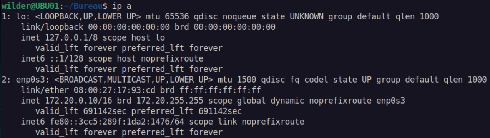
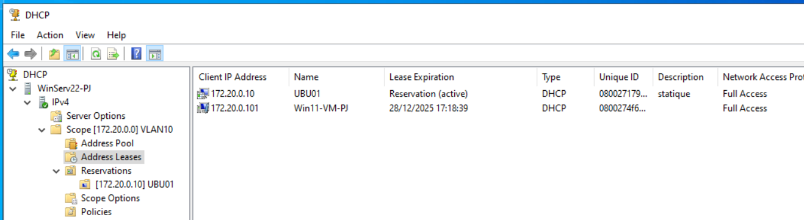

# DHCP

### La configuration DHCP du serveur

### La configuration IP du 1er client  

### La configuration IP du second client

### L'affichage de la fenêtre de réservation sur le serveur

### Leases  

